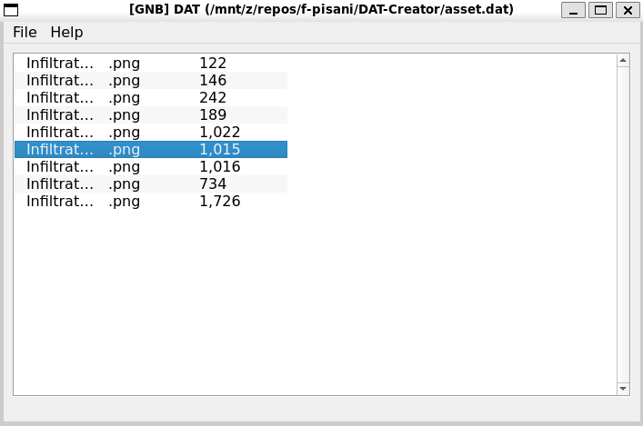

# DAT Creator

<p align="center">
  
</p>

A Qt5-based graphical application for creating and managing DAT archive files. This is an old hobby project that provides a simple GUI interface for bundling multiple files into a single DAT archive format.

> This is an old hobby project created for personal use and learning purposes. It may not follow modern best practices or have comprehensive error handling. The DAT file format is custom and not compatible with other archive formats.

## About

DAT Creator is a legacy project built with C++11 and Qt5. It allows users to:
- Create new DAT archive files
- Add files to existing archives
- Extract files from archives
- Rename files within archives
- Remove files from archives
- Browse archive contents in a tree view

The application uses a custom DAT file format to store multiple files with their names and binary data in a single archive file.

## Requirements

- C++11 compatible compiler (g++ 4.8+ or clang 3.3+)
- Qt5 development libraries
- Make

## Building from Source

### Install Dependencies

#### Ubuntu/Debian:
```bash
sudo apt-get update
sudo apt-get install -y build-essential qt5-default qtbase5-dev qtbase5-dev-tools
```

#### Fedora/RHEL:
```bash
sudo dnf install gcc-c++ qt5-qtbase-devel make
```

#### Arch Linux:
```bash
sudo pacman -S base-devel qt5-base
```

### Build Instructions

1. Clone the repository:
```bash
git clone https://github.com/f-pisani/DAT-Creator.git
cd DAT-Creator
```

2. Build the project:
```bash
make
```

3. Run the application:
```bash
make run
```

### Other Build Options

- **Debug build**: `make debug`
- **Release build**: `make release`
- **Clean build files**: `make clean`
- **Clean all generated files**: `make distclean`
- **Show help**: `make help`

## Usage

1. Launch the application using `./build/DAT` or `make run`
2. Use the File menu to:
   - Create a new DAT archive (File → New)
   - Open an existing DAT file (File → Load)
   - Save the current archive (File → Save/Save As)
3. Use the toolbar or right-click context menu to:
   - Add files to the archive
   - Extract selected files
   - Rename files within the archive
   - Remove files from the archive

## Project Structure

```
DAT-Creator/
├── gui/               # GUI components (MainWindow, dialogs)
├── lib/               # Core DAT file handling library
├── build/             # Build output directory (created by make)
├── DAT.pro            # Qt project file
├── main.cpp           # Application entry point
└── asset.dat          # Sample DAT file
```
